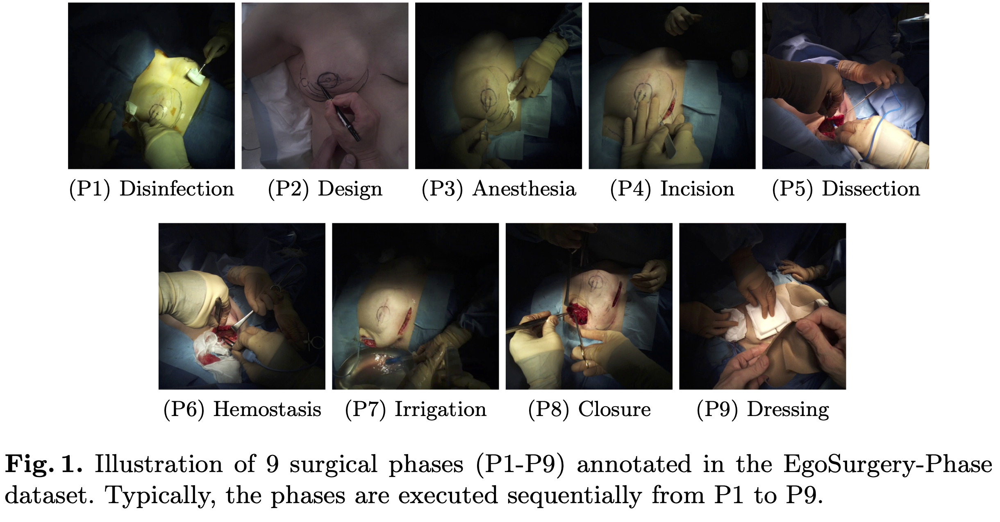

# <p align="center">EgoSurgery: A Dataset for Surgical Video Understanding from Egocentric Open Surgery Videos</p>

## News and Announcements
* [2024-09] EgoSurgery-Phase and EgoSurgery-Tool are now available. Thank you for your patience.
* [2024-05] Our paper EgoSurgery-Phase is accepted to MICCAI 2024! (early acceptance within the top 11%)

## 💡 Overview
We introduce EgoSurgery, an egocentric surgical video dataset and benchmark. Our goal is to provide training and benchmarking data for research in egocentric surgical video understanding.

## 📚 Dataset
### EgoSurgery-Phase (MICCAI 2024) [[ArXiv]](https://arxiv.org/abs/2405.19644)
EgoSurgery-Phase is the first real open surgery video dataset for surgical phase recognition.
<p align="center">
  
</p>

### EgoSurgery-Tool [[ArXiv]](https://arxiv.org/abs/2406.03095)
EgoSurgery-Tool provides surgical tool and hand bounding box annotations.
<p align="center">
  
</p>

## Download
Additional anonymization is required and is currently being reviewed by a doctor. Once the process is complete, the dataset will be provided via Box. Please fill out the [google form](https://forms.gle/T7Kdqozz9C2kFBZs5) and wait for further instructions. Thank you for your patience.

## Reference
If you are interested in our work and want to cite it, please acknowledge the following paper:
```
@InProceedings{fujii2024egosurgeryphase,
  title        = {EgoSurgery-Phase: A Dataset of Surgical Phase Recognition from Egocentric Open Surgery Videos},
  author       = {Ryo Fujii and Masashi Hatano and Hideo Saito and Hiroki Kajita},
  year         = {2024},
  booktitle    = {MICCAI},
}

@article{fujii2024egosurgerytool,
  title        = {EgoSurgery-Tool: A Dataset of Surgical Tool and Hand Detection from Egocentric Open Surgery Videos},
  author       = {Fujii, Ryo and Saito, Hideo and Kajita, Hiroki},
  journal      = {arXiv preprint arXiv:2406.03095},
  year         = {2024},
}

@article{fujii2022surgicaltool,
  title        = {Surgical Tool Detection in Open Surgery Videos},
  author       = {Fujii, Ryo and Hachiuma, Ryo and Kajita, Hiroki and Saito, Hideo},
  journal      = {Applied Sciences},
  year         = {2022},
}
```
